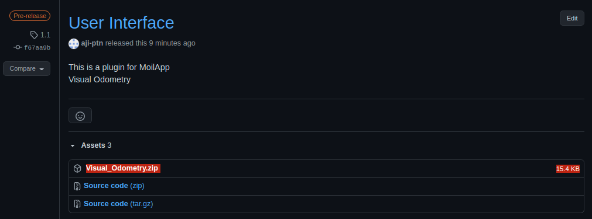
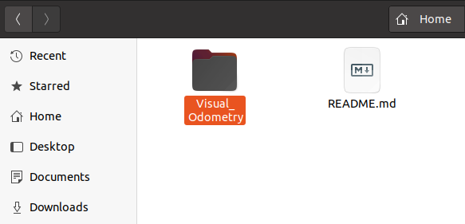
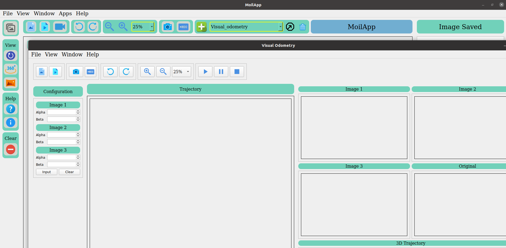

# User Interface Plugin for Visual Odometry
This repository contain **Plugin** for [MoilApp](https://github.com/MoilOrg/MoilApp.git)

## how to run this repository
1. Make sure you have Moilapp on your computer, [click this MoilApp](https://github.com/MoilOrg/MoilApp.git)
2. clone this repository

```buildoutcfg
git clone https://github.com/Herusyahputra/Research-Monocular-VO.git
```
3. or you can click [this link](https://github.com/MoilOrg/Progress-Aji/releases/download/1.1/Visual_Odometry.zip) to download UI and unzip the file
    * Download **Visual_Odometry.zip**
   
    * Unzip file 
   
4. open your Moilapp program
5. add new plugin into your Moilapp 
   * to add new plugin into your Moilapp click add plugin and direct to **this folder** on your directory from repository (step 2) that your clone or .zip (step 3)
   
   

### Click This picture to Follow video tutorial 

[](https://youtu.be/eYGVmF9JsXE)